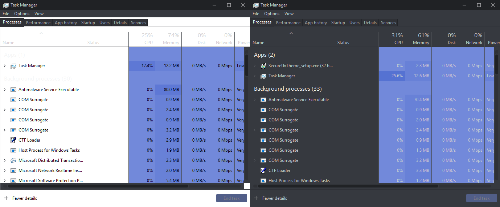
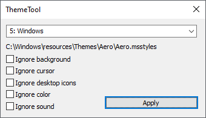
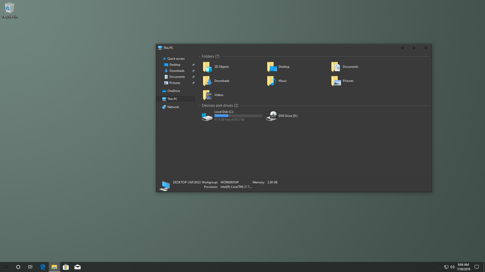

# SecureUxTheme

   

## About

SecureUxTheme is a software that removes signature verification of styles from Windows.

## Features

* No system file modifications
* No driver needed
* Secure boot compatible
* Probably quite future-proof
* Fixes LogonUI resetting some colors on locking

## Limitations

Styles must still have a format-wise valid signature appended, it is just not verified. For this reason themes need to be applied with the tool, rather than in Personalization / Themes.

## Operating System Support\*

* Windows 8.1
* Windows 10 (tested: 1507, 1607, 1809, 1903, 1909, 2004, 20H2, 21H1, 21H2, 20348.*)
* Windows 11 (tested: 21H2)
* Future versions\*\*

\* Windows 7 or older will never be supported due to the way themes are implemented.

\*\* The current code doesn't depend on any code, binary or memory layout of uxtheme and related dlls, therefore should work unless major changes are made to how themes in general work.

## Download

[Latest release](https://github.com/namazso/SecureUxTheme/releases/latest/download/ThemeTool.exe)

[Development builds](https://github.com/namazso/SecureUxTheme/actions)

[Scoop:](https://scoop.sh/)
```shell
scoop bucket add extras
scoop install secureuxtheme
```

## Download is MALWARE???

Some silly antiviruses tend to flag the tool as malware, because it's unsigned (this method of detection [clearly](https://www.securityweek.com/use-fake-code-signing-certificates-malware-surges) [works](https://www.zdnet.com/article/hackers-are-selling-legitimate-code-signing-certificates-to-evade-malware-detection/) [btw](https://web.archive.org/web/20200720160419/http://signedmalware.org/). I'm submitting all releases before release to Microsoft for analysis if they're detected by Defender, but I can't guarantee the same for all the other AVs. If you have a signing certificate and are willing help signing, please contact me.

### Garbage Antiviruses

Some antiviruses might not detect `ThemeTool.exe` but detect the installed dll (`system32\SecureUxTheme.dll`) and delete it. If this happens your computer will be stuck at the login screen. See the FAQ entry for fixing this, and I'd recommend getting rid of the garbage AV that caused this.

**Because of this, after install you might want to add SecureUxTheme.dll to the exclusions of your antivirus, so it doesn't randomly break your install.**

### But I still don't trust it.

Compile it yourself.

## LogonUI fix

Locking Windows makes LogonUI reset certain colors and ignore the currently set style. This tool can fix this problem. A picture comparison showing the Task Manager opened after locking Windows without and with the fix can be seen here:



Do note this feature might mess up some high contrast theme features when locking.

## Screenshot

Program:



This is only a tool for enabling custom themes, no actual visual changes will be made.
Regardless, here's a cool theme for illustration:



[Theme used](https://www.deviantart.com/niivu/art/10-Pro-Edition-802720222)

## Where to get themes

I recommend [DeviantArt](https://www.deviantart.com/tag/windows10themes) for finding themes, although it is a bit noisy. Alternatives are [7themes.su](https://7themes.su/) which is much more organized (but be wary of fake adware download buttons! use the one that says Яндекс.Диск). Also, you can just search for themes with your favorite search engine. Make sure that the theme you're about to apply is compatible with your windows version.

## Donations

This software is provided completely free of charge to you, however I spent time and effort developing it. If you like this software, please consider making a donation:

* Bitcoin: 1N6UzYgzn3sLV33hB2iS3FvYLzD1G4CuS2
* Monero: 83sJ6GoeKf1U47vD9Tk6y2MEKJKxPJkECG3Ms7yzVGeiBYg2uYhBAUAZKNDH8VnAPGhwhZeqBnofDPgw9PiVtTgk95k53Rd

## Frequently Asked Questions

### **Q: Help, SecureUxTheme broke my install and it's login looping now**

A: [Help: Login loop after installing SecureUxTheme](https://github.com/namazso/SecureUxTheme/wiki/Help:-Login-loop-after-installing-SecureUxTheme)

---

### **Q: Help, a theme broke my install and it's login looping now**

A: [Help: Login loop after setting a theme](https://github.com/namazso/SecureUxTheme/wiki/Help:-Login-loop-after-setting-a-theme)

---

### **Q: I just want a themed Windows, what do I do with all this?**

A: [Help: Step by step installing SecureUxTheme and a custom theme](https://github.com/namazso/SecureUxTheme/wiki/Help:-Step-by-step-installing-SecureUxTheme-and-a-custom-theme)

---

### **Q: I have 1909 or later, and the Address bar / Search bar is weird when clicked**

A: Consider using OldNewExplorer which fixes this. Alternatively, see [Issue #6](https://github.com/namazso/SecureUxTheme/issues/6).

---

### **Q: Can you make themes per-program?**

A: Unfortunately, this is [close to impossible](https://github.com/namazso/SecureUxTheme/issues/9#issuecomment-611897882). However for Office programs, there is a [plugin](https://github.com/matafokka/ExcelDarkThemeFix) for fixing this.

---

### **Q:** `SelectTheme: pTheme->GetVisualStyle failed with 80070002`

A: You probably installed a theme by opening / double clicking. Custom themes cannot be installed like that, they must be moved to `%WINDIR%\Resources\Themes` with all their accompanying files.

## Is it SecureUxTheme or ThemeTool? And what does it stand for anyways?

Naming has been pretty messy in this project, I admit that. Originally this project was for myself, and consisted of only the hooking dll, and required hex-editing the invalid signature to the themes. The project was named SecureUxTheme. In hindsight, this was a pretty bad naming. While it contains "secure" in the name, it is rather "safe" instead of "secure". The UxTheme part comes from the dll name (`uxtheme.dll`) which needed to be patched on XP when visual styles were introduced. This dll is no longer containing the signature verification code since Windows Vista, however the name stuck, and all software similar to this are called uxtheme-patchers. Anyways, after deciding to release, I added a new component named "ThemeInvalidSigner" for adding the invalid signature to themes, and also an NSIS installer so that you don't have to run .reg files. This was the initial release. Later I grew tired of various problems and issue reports with the built-in Personalization I was using for letting users set themes, and this is when ThemeTool was born. It originally was a proof-of-concept app for setting themes via the IThemeManager2 COM interface I reverse-engineered, however it soon got the capability of patching themes, and eventually replaced the installer too. This also improved on the virus detections, for unknown reasons.

**TL;DR**: SecureUxTheme is the project and the hook dll, ThemeTool is the installer / UI component.

## Building

### Requirements

* Visual Studio 2019 with x86, x64, ARM64 toolchains

### Compiling

Note that the order of the builds is important, building ThemeTool will fail if some architecture is missing SecureUxTheme build.

1. Open SecureUxTheme.sln
2. Build SecureUxTheme as Release/Win32
3. Build SecureUxTheme as Release/ARM64
4. Build SecureUxTheme as Release/x64
5. Build ThemeTool as Release/Win32

### Debugging

lmao

## License Statement

	SecureUxTheme - A secure boot compatible in-memory UxTheme patcher
	Copyright (C) 2020  namazso
	
	This program is free software: you can redistribute it and/or modify
	it under the terms of the GNU General Public License as published by
	the Free Software Foundation, either version 3 of the License, or
	(at your option) any later version.
	
	This program is distributed in the hope that it will be useful,
	but WITHOUT ANY WARRANTY; without even the implied warranty of
	MERCHANTABILITY or FITNESS FOR A PARTICULAR PURPOSE.  See the
	GNU General Public License for more details.
	
	You should have received a copy of the GNU General Public License
	along with this program.  If not, see <https://www.gnu.org/licenses/>.
