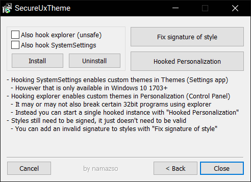

# SecureUxTheme

## About

SecureUxTheme is a software that removes signature verification of styles from Windows.

## Features

* No system file modifications
* No driver needed
* Secure boot compatible
* Probably quite future-proof

## Limitations

Styles must still have a format-wise valid signature appended, it is just not verified. A tool for fixing styles without or with invalid one is included in the installer.

## Operating System Support\*

* Windows 8.1
* Windows 10 (tested: 1507, 1607, 1809, 1903, 20H1 Insider 18963)
* Future versions\*\*

\* Windows 7 will never be supported due to the way themes are implemented.

\*\* The current code doesn't depend on any code, binary or memory layout of uxtheme and related dlls, therefore should work unless major changes are made to how themes in general work.

## Download

[Latest release](https://github.com/namazso/SecureUxTheme/releases/latest/download/SecureUxTheme_setup.exe)

## Screenshot

Installer:

This is only a tool for enabling custom themes, no actual visual changes will be made.
Regardless, here's a cool theme for illustration:

[Theme used](https://7themes.su/load/windows_10_themes/temnye/10_pro_edition/34-1-0-1321)

## Where to get themes

I recommend [7themes.su](https://7themes.su/) for finding themes. Alternatives are [DeviantArt](https://www.deviantart.com/customization/skins/windows/win10/newest/?offset=0), and if you don't mind paying [cleodesktop](https://www.cleodesktop.com/), although I haven't tried that. Also, you can just search for themes with your favorite search engine.

## Donations

This software is provided completely free of charge to you, however I spent time and effort developing it. If you like this software, please consider making a donation:

* Bitcoin: 1N6UzYgzn3sLV33hB2iS3FvYLzD1G4CuS2
* Monero: 83sJ6GoeKf1U47vD9Tk6y2MEKJKxPJkECG3Ms7yzVGeiBYg2uYhBAUAZKNDH8VnAPGhwhZeqBnofDPgw9PiVtTgk95k53Rd

## Recovery

Despite best effort things may always break so bad they prevent booting up windows.
For recovering from such situation there is a [document](resources/RECOVERY.md) that should help you.

## Building

### Requirements

* Visual Studio 2017 (newer ones not tested)
* [Nullsoft Scriptable Install System](https://nsis.sourceforge.io/)

### Compiling

1. Open SecureUxTheme.sln and click __Build Solution__ on x64/Release and Win32/Release settings
2. Use NSIS to compile installer.nsi to get the installer

## License Statement

	SecureUxTheme - A secure boot compatible in-memory UxTheme patcher
	Copyright (C) 2019  namazso
	
	This program is free software: you can redistribute it and/or modify
	it under the terms of the GNU General Public License as published by
	the Free Software Foundation, either version 3 of the License, or
	(at your option) any later version.
	
	This program is distributed in the hope that it will be useful,
	but WITHOUT ANY WARRANTY; without even the implied warranty of
	MERCHANTABILITY or FITNESS FOR A PARTICULAR PURPOSE.  See the
	GNU General Public License for more details.
	
	You should have received a copy of the GNU General Public License
	along with this program.  If not, see <https://www.gnu.org/licenses/>.
